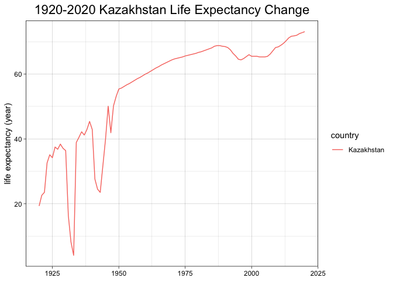
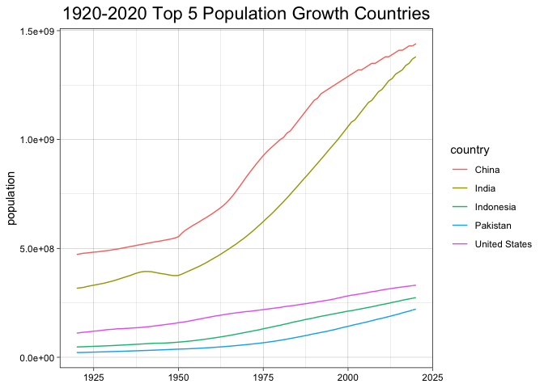
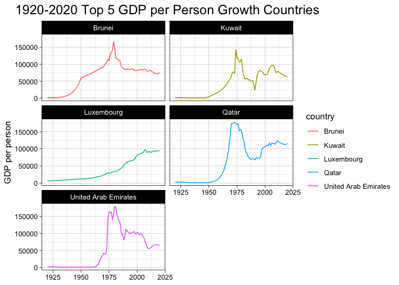
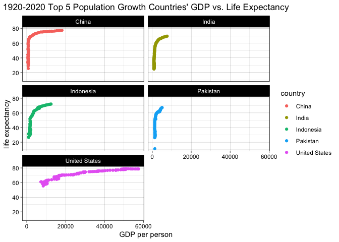

## Instructions
Answer the following questions and complete the exercises in RMarkdown. Please embed all of your code and push your final work to your repository. Your code should be organized, clean, and run free from errors. Be sure to **add your name** to the author header above. You may use any resources to answer these questions (including each other), but you may not post questions to Open Stacks or external help sites. There are 10 total questions.  

Make sure to use the formatting conventions of RMarkdown to make your report neat and clean! Your plots should use consistent aesthetics throughout.  

This exam is due by **12:00p on Tuesday, February 22**.  

## Gapminder
For this assignment, we are going to use data from  [gapminder](https://www.gapminder.org/). Gapminder includes information about economics, population, social issues, and life expectancy from countries all over the world. We will use three data sets, so please load all three as separate objects.    

1. population_total.csv  
2. income_per_person_gdppercapita_ppp_inflation_adjusted.csv  
3. life_expectancy_years.csv  


```r
library(tidyverse)
library(RColorBrewer)
library(paletteer)
library(janitor)
library(here)
library(skimr)
```


```r
population <- readr::read_csv("data/population_total.csv")
```

```
## Rows: 195 Columns: 302
## ── Column specification ────────────────────────────────────────────────────────
## Delimiter: ","
## chr   (1): country
## dbl (301): 1800, 1801, 1802, 1803, 1804, 1805, 1806, 1807, 1808, 1809, 1810,...
## 
## ℹ Use `spec()` to retrieve the full column specification for this data.
## ℹ Specify the column types or set `show_col_types = FALSE` to quiet this message.
```

```r
life <- readr::read_csv("data/life_expectancy_years.csv")
```

```
## Rows: 187 Columns: 302
## ── Column specification ────────────────────────────────────────────────────────
## Delimiter: ","
## chr   (1): country
## dbl (301): 1800, 1801, 1802, 1803, 1804, 1805, 1806, 1807, 1808, 1809, 1810,...
## 
## ℹ Use `spec()` to retrieve the full column specification for this data.
## ℹ Specify the column types or set `show_col_types = FALSE` to quiet this message.
```

```r
income <- readr::read_csv("data/income_per_person_gdppercapita_ppp_inflation_adjusted.csv")
```

```
## Rows: 193 Columns: 242
## ── Column specification ────────────────────────────────────────────────────────
## Delimiter: ","
## chr   (1): country
## dbl (241): 1800, 1801, 1802, 1803, 1804, 1805, 1806, 1807, 1808, 1809, 1810,...
## 
## ℹ Use `spec()` to retrieve the full column specification for this data.
## ℹ Specify the column types or set `show_col_types = FALSE` to quiet this message.
```

1. (3 points) Once you have an idea of the structure of the data, please make each data set tidy (hint: think back to pivots) and store them as new objects. You will need both the original (wide) and tidy (long) data!  

```r
population_long <- population %>% 
  pivot_longer(-country,
               names_to = "year",
               values_to = "population_value")
```


```r
income_long <- income %>% 
  pivot_longer(-country,
               names_to = "year",
               values_to = "income_value")
```


```r
life_long <- life %>% 
  pivot_longer(-country,
               names_to = "year",
               values_to = "life_value")
```


2. (1 point) How many different countries are represented in the data? Provide the total number and their names. Since each data set includes different numbers of countries, you will need to do this for each one. 

Population data has 195 countries; income data has 193 countries; life data has 187 countries.


```r
population_long %>% 
  count(country)
```

```
## # A tibble: 195 × 2
##    country                 n
##    <chr>               <int>
##  1 Afghanistan           301
##  2 Albania               301
##  3 Algeria               301
##  4 Andorra               301
##  5 Angola                301
##  6 Antigua and Barbuda   301
##  7 Argentina             301
##  8 Armenia               301
##  9 Australia             301
## 10 Austria               301
## # … with 185 more rows
```

```r
income_long %>% 
  count(country)
```

```
## # A tibble: 193 × 2
##    country                 n
##    <chr>               <int>
##  1 Afghanistan           241
##  2 Albania               241
##  3 Algeria               241
##  4 Andorra               241
##  5 Angola                241
##  6 Antigua and Barbuda   241
##  7 Argentina             241
##  8 Armenia               241
##  9 Australia             241
## 10 Austria               241
## # … with 183 more rows
```

```r
life_long %>% 
  count(country)
```

```
## # A tibble: 187 × 2
##    country                 n
##    <chr>               <int>
##  1 Afghanistan           301
##  2 Albania               301
##  3 Algeria               301
##  4 Andorra               301
##  5 Angola                301
##  6 Antigua and Barbuda   301
##  7 Argentina             301
##  8 Armenia               301
##  9 Australia             301
## 10 Austria               301
## # … with 177 more rows
```

## Life Expectancy  

3. (2 points) Let's limit the data to 100 years (1920-2020). For these years, which country has the highest average life expectancy? How about the lowest average life expectancy?  

Andorra has the highest average life expectancy, which is 79.77 years old; Central African Republic has the lowest average life expectancy, which is 41.77 years old.

```r
life_long %>% 
  filter(year>= "1920" & year <= "2020") %>% 
  group_by(country) %>% 
  summarize(avg_life_exp = mean(life_value, na.rm=T)) %>% 
  arrange(desc(avg_life_exp))
```

```
## # A tibble: 187 × 2
##    country     avg_life_exp
##    <chr>              <dbl>
##  1 Andorra             79.8
##  2 Sweden              73.5
##  3 Norway              73.2
##  4 Netherlands         73.0
##  5 Dominica            73.0
##  6 Iceland             72.9
##  7 Australia           72.7
##  8 Switzerland         72.7
##  9 Denmark             71.9
## 10 Canada              71.8
## # … with 177 more rows
```

```r
  #arrange(avg_life_exp)
```

4. (3 points) Although we can see which country has the highest life expectancy for the past 100 years, we don't know which countries have changed the most. What are the top 5 countries that have experienced the biggest improvement in life expectancy between 1920-2020?  

```r
life_long %>% 
  filter(year>= "1920" & year <= "2020") %>% 
  group_by(country) %>% 
  summarize(life_exp_improvement = max(life_value, na.rm = T) - min(life_value, na.rm = T)) %>% 
  arrange(desc(life_exp_improvement)) %>% 
  top_n(5, life_exp_improvement)
```

```
## # A tibble: 5 × 2
##   country         life_exp_improvement
##   <chr>                          <dbl>
## 1 Kazakhstan                      69.0
## 2 Lithuania                       63.6
## 3 Poland                          63.1
## 4 Ukraine                         62.9
## 5 Kyrgyz Republic                 61.2
```

5. (3 points) Make a plot that shows the change over the past 100 years for the country with the biggest improvement in life expectancy. Be sure to add appropriate aesthetics to make the plot clean and clear. Once you have made the plot, do a little internet searching and see if you can discover what historical event may have contributed to this remarkable change.  

Kazakhstan's population has a huge decrease during 1930-1935 (especially 1933), I found that there was a Kazakh famine from 1931 to 1933 and many people died.

```r
life_long %>% 
  filter(country == "Kazakhstan" & year >= "1920" & year <= "2020") %>% 
  ggplot(aes(x=as.integer(year), y=life_value, group=1, color = country))+
  geom_line()+
  theme_linedraw()+
  scale_fill_brewer(palette = "Pastel1")+
  labs(title = "1920-2020 Kazakhstan Life Expectancy Change",
       x=NULL,
       y="life expectancy (year)")+
  theme(plot.title = element_text(size = rel(1.5), hjust = 0.5))
```

<!-- -->


## Population Growth
6. (3 points) Which 5 countries have had the highest population growth over the past 100 years (1920-2020)?  

```r
population_long %>% 
  filter(year>="1920" & year<="2020") %>% 
  group_by(country) %>% 
  summarize(population_growth = max(population_value, na.rm = T) - min(population_value, na.rm = T)) %>% 
  arrange(desc(population_growth)) %>% 
  top_n(5, population_growth)
```

```
## # A tibble: 5 × 2
##   country       population_growth
##   <chr>                     <dbl>
## 1 India                1063000000
## 2 China                 968000000
## 3 Indonesia             226700000
## 4 United States         220000000
## 5 Pakistan              199300000
```

7. (4 points) Produce a plot that shows the 5 countries that have had the highest population growth over the past 100 years (1920-2020). Which countries appear to have had exponential growth?  

India and China had exponential growth.


```r
population_long %>% 
  filter(year>="1920" & year<="2020") %>% 
  filter(country == "India"|country == "China"|country == "Indonesia"|country == "United States"|country == "Pakistan") %>% 
  ggplot(aes(x=as.integer(year), y=population_value, color=country))+
  geom_line()+
  theme_linedraw()+
  scale_fill_brewer(palette = "Pastel1")+
  labs(title = "1920-2020 Top 5 Population Growth Countries",
       x=NULL,
       y="population")+
  theme(plot.title = element_text(size = rel(1.5), hjust = 0.5))
```

<!-- -->


## Income
The units used for income are gross domestic product per person adjusted for differences in purchasing power in international dollars.

8. (4 points) As in the previous questions, which countries have experienced the biggest growth in per person GDP. Show this as a table and then plot the changes for the top 5 countries. With a bit of research, you should be able to explain the dramatic downturns of the wealthiest economies that occurred during the 1980's.  

```r
income_long %>% 
  filter(year >= "1920" & year <="2020") %>% 
  group_by(country) %>% 
  summarize(GDP_per_person_change = max(income_value, na.rm = T) - min(income_value, na.rm = T)) %>% 
  arrange(desc(GDP_per_person_change)) %>% 
  top_n(5, GDP_per_person_change)
```

```
## # A tibble: 5 × 2
##   country              GDP_per_person_change
##   <chr>                                <dbl>
## 1 United Arab Emirates                177840
## 2 Qatar                               176920
## 3 Brunei                              163870
## 4 Kuwait                              141560
## 5 Luxembourg                           92170
```


```r
income_long %>% 
  filter(year>="1920" & year<="2020") %>% 
  filter(country == "United Arab Emirates"|country == "Qatar"|country == "Brunei"|country == "Kuwait"|country == "Luxembourg") %>% 
  ggplot(aes(x=as.integer(year), y=income_value, color=country))+
  geom_line()+
  facet_wrap(~country, ncol=2)+
  theme_linedraw()+
  scale_fill_brewer(palette = "Pastel1")+
  labs(title = "1920-2020 Top 5 GDP per Person Growth Countries",
       x=NULL,
       y="GDP per person")+
  theme(plot.title = element_text(size = rel(1.5), hjust = 0.5))
```

<!-- -->
Because 1979 Oil Crisis, the oil price increased dramatically. Kuwait, Qatar and United Arab Emirates are all oil export countries so they earned a lot during energy crisis. But in 1982 Middle East countries suffered from Lebanon War so the economies also had a huge decrease.

9. (3 points) Create three new objects that restrict each data set (life expectancy, population, income) to the years 1920-2020. Hint: I suggest doing this with the long form of your data. Once this is done, merge all three data sets using the code I provide below. You may need to adjust the code depending on how you have named your objects. I called mine `life_expectancy_100`, `population_100`, and `income_100`. For some of you, learning these `joins` will be important for your project.  


```r
life_long_1920_2020 <- life_long %>% 
  filter(year>="1920" & year<="2020")
```


```r
population_long_1920_2020 <- population_long %>% 
  filter(year>="1920" & year<="2020")
```


```r
income_long_1920_2020 <- income_long %>% 
  filter(year>="1920" & year<="2020")
```


```r
gapminder_join <- inner_join(life_long_1920_2020, population_long_1920_2020, by= c("country", "year"))
gapminder_join <- inner_join(gapminder_join, income_long_1920_2020, by= c("country", "year"))
gapminder_join #yaaaaaaaaay that's cool and super useful
```

```
## # A tibble: 18,887 × 5
##    country     year  life_value population_value income_value
##    <chr>       <chr>      <dbl>            <dbl>        <dbl>
##  1 Afghanistan 1920        30.6         10600000         1490
##  2 Afghanistan 1921        30.7         10500000         1520
##  3 Afghanistan 1922        30.8         10300000         1550
##  4 Afghanistan 1923        30.8          9710000         1570
##  5 Afghanistan 1924        30.9          9200000         1600
##  6 Afghanistan 1925        31            8720000         1630
##  7 Afghanistan 1926        31            8260000         1650
##  8 Afghanistan 1927        31.1          7830000         1680
##  9 Afghanistan 1928        31.1          7420000         1710
## 10 Afghanistan 1929        31.2          7100000         1740
## # … with 18,877 more rows
```

10. (4 points) Use the joined data to perform an analysis of your choice. The analysis should include a comparison between two or more of the variables `life_expectancy`, `population`, or `income.`  

I want to analyze population growth top 5 countries (from question #6) GDP vs. Life Expectancy to see if higher GDP is related with life expectancy in dense population countries.


```r
gapminder_join %>% 
  filter(country == "India"|country == "China"|country == "Indonesia"|country == "United States"|country == "Pakistan") %>% #population growth top 5 countries
  ggplot(aes(x=income_value, y=life_value, color=country))+
  geom_point()+
  facet_wrap(~country, ncol=2)+
  theme_linedraw()+
  scale_fill_brewer(palette = "Pastel1")+
  labs(title = "1920-2020 Top 5 Population Growth Countries' GDP vs. Life Expectancy",
       x="GDP per person",
       y="life expectancy")+
  theme(plot.title = element_text(hjust = 0.5))
```

<!-- -->

